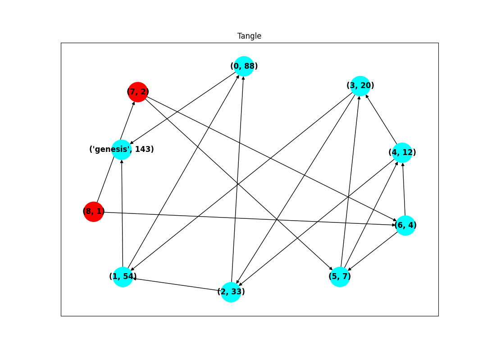

# CS4371 Project - *Based on Tangle CV*

Group members: **Kevin Garcia Lopez, Robert Elizondo, Robert Bonham, Rishita Elaganti**

## INSTRUCTIONS ON RUNNING
* There is some libraries/packages that need to be installed in order to run our Tangle CV simulation: 
    - matplotlib: <code> $ pip install -U matplotlib </code>
    - networkx: <code> $ pip install networkx </code>
    - numpy: <code> $ pip install numpy </code>
* After clonning this repo or extracting the zip contents:
  - the code can be run by executing the Driver.py file - <code> $ python3 Driver.py </code> 
  - The user will be prompted to input the number of transactions/nodes they want added to the TangleCV graph and can be changed as needed. This will create a randomized TangleCV graph with the specified number of nodes. The graph will display the id of the node, and its cumulative weight, respectively. The nodes that have been validated by at least two other nodes, will be cyan and those that have not been validated by at least 2 other nodes, the tips, will be red. An image like the following will be generated:
  - 
  - The terminal will also output the transactions fields, twice for each transaction, one with the plain fields and one with the encrypted fields:
  -  

## PROJECT OVERVIEW
This project simulates and builds out a TangleCV graph of transactions, as specified in the research paper (details in the presentation). We decided to narrow our focus of our simulation on the creation and maintainance of the TangleCV graph itself. We created randomized transaction approval requests, which arrive to our network following a Poisson distribution, and update the graph appropriately.

## We changed the following aspects of the TangleCV Algorithm:
- [x] Each transaction's data is encrypted/decrypted using a Caesar cipher rather than being stored using plain text.
- [x] Our tip selection is different as well - we chose to select the two most recently added tips, and if those are not valid, then pick randomly. This is because the tip selection algorithm defined in the paper relies on using on-board vehicle sensors to verify the reported BSM data of each node. Since we are not simulating the physical aspects of this paper, we have no ways of validating any included BSM data, so we decided to leave it out.